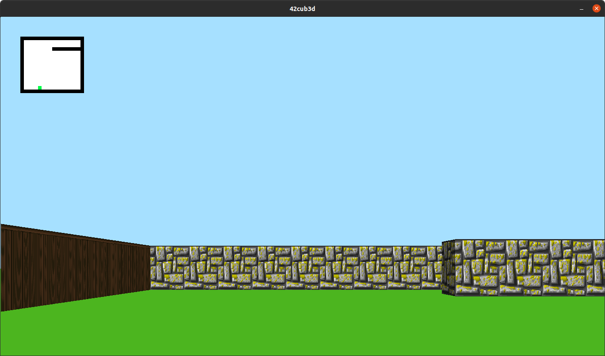

## Cub3D

### About

This project is about creating a wolfenstein 3D game, which was the first FPS ever. The goal is to make a dynamic view inside a maze with Ray-casting algorithm.

* External functions: open, close, read, write, printf, malloc, free, perror, strerror, exit and all functions of the <math.h>

* External libraries: miniLibX.
This library was developed
internally and includes the minimum necessary to open a window, light a pixel and deal
with events linked to this window: keyboard and mouse.

All functions are created in accordance with [Norm](https://github.com/42School/norminette) - the bunch of rules how code should be formatted.

### Features
* Raycasting algorithm without light sources (same brightness throughout the map).
* Possibility to set the floor and ceiling colors to two different ones.
* Player movement & camera rotation.
* Parser of the map, the ability to create your own.
* Textures in 4 directions (N/S/W/E), the ability to set textures in .xpm format of any resolution.

### Map rules

```
NO ./path_to_the_north_texture.xpm
SO ./path_to_the_south_texture.xpm
WE ./path_to_the_west_texture.xpm
EA ./path_to_the_east_texture.xpm
F 220,100,0
C 225,30,0

1111111111111111111111111
1000000000110000000000001
1011000001110000000000001
1001000000000000000000001
111111111011000001110000000000001
100000000011000001110111111111111
11110111111111011100000010001
11110111111111011101010010001
11000000110101011100000010001
10000000000000001100000010001
10000000000000001101010010001
11000001110101011111011110N0111
11110111 1110101 101111010001
11111111 1111111 111111111111
```

The map must be composed of only 6 possible characters: 0 for an empty space,
1 for a wall, and N,S,E or W for the player’s start position and spawning
orientation.

* The map must be closed/surrounded by walls.
* Except for the map content, each type of element can be separated by one or
more empty line(s).
* Except for the map content which always has to be the last, each type of
element can be set in any order in the file.
* Except for the map, each type of information from an element can be separated
by one or more space(s).
* Spaces are a valid part of the map.
* Minimap with player's position.

### Requirements & usage
Project requires:
* C Lang compiler: **gcc** or **clang**
* Possibility to work with Makefile
* MiniLibX library

MiniLibX for Linux requires xorg, x11 and zlib, therefore you will need to install the following dependencies: xorg, libxext-dev and zlib1g-dev. Installing these dependencies on Ubuntu can be done as follows:

```
$> sudo apt-get install gcc make xorg libxext-dev libbsd-dev
$> sudo apt-get update && sudo apt-get install xorg libxext-dev zlib1g-dev
```

Tested on:
* MacOS 10.15
* Linux Ubuntu 20.04

Run:
```
$> make all
$> ./cub3d [path_to_the_map]
```



### Controls

* W/A/S/D - Move
* Left/Right Arrow - Camera rotation
* ESC - Exit